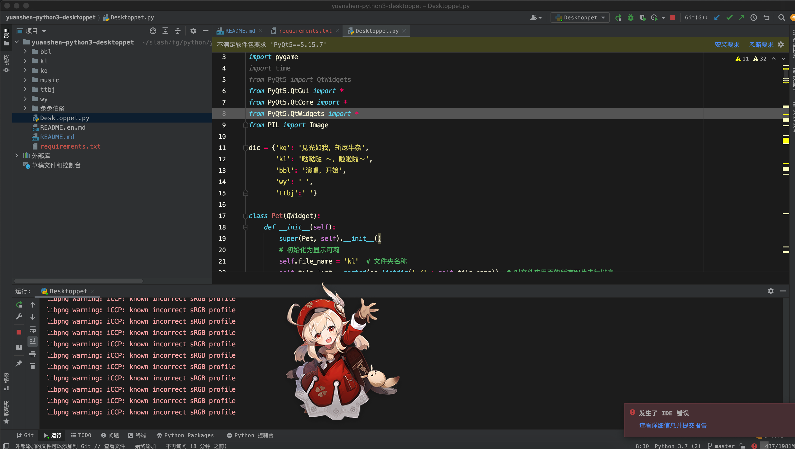
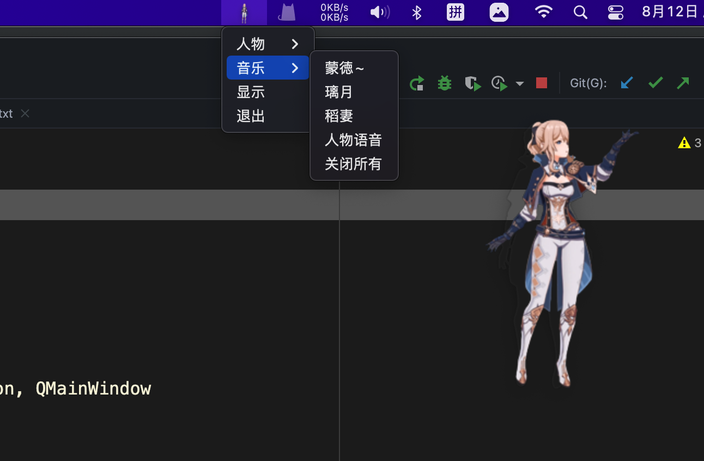

# 原神-基于python3的桌面宠物

#### 介绍
这是基于pyqt5开发的原神桌面宠物，目前支持的角色有Q版万叶、刻晴、芭芭拉、可莉、兔兔伯爵，欢迎大佬分享抠图素材。所有的png图片都已经上传到本项目，欢迎各位二刺猿来下载使用，只是无聊才随便写写，打发打发时间，不说了，肝原神去咯！

#### 软件架构
原来你也玩原神！

#### 安装教程

1.  git clone https://gitee.com/fg_slash/yuanshen-python3-desktoppet.git 克隆项目。
2.  cd yuanshen-python3-desktoppet 进入目录 pip install -r requirements.txt 安装依赖。
3.  python Desktoppet.py 运行py文件。

#### 使用说明

1. 使用pyqt5开发的原神桌面宠物，目前支持Q版万叶、刻晴、芭芭拉、可莉、兔兔伯爵。

2. 所有的图片已经用png格式全部上传，下载项目就可以运行，欢迎大佬提供其他人物（太难了>_<）

3. 桌面宠物可以拖动和切换，动画会以循环播放的方式进行，当鼠标移动到区域时候会播放语音（上班请静音，小心社死！）

   

   

#### 参与贡献

1.  Fork 本仓库
2.  新建 Feat_xxx 分支
3.  提交代码
4.  新建 Pull Request

#### 特技

1.  使用 Readme\_XXX.md 来支持不同的语言，例如 Readme\_en.md, Readme\_zh.md
2.  Gitee 官方博客 [blog.gitee.com](https://blog.gitee.com)
3.  你可以 [https://gitee.com/explore](https://gitee.com/explore) 这个地址来了解 Gitee 上的优秀开源项目
4.  [GVP](https://gitee.com/gvp) 全称是 Gitee 最有价值开源项目，是综合评定出的优秀开源项目
5.  Gitee 官方提供的使用手册 [https://gitee.com/help](https://gitee.com/help)
6.  Gitee 封面人物是一档用来展示 Gitee 会员风采的栏目 [https://gitee.com/gitee-stars/](https://gitee.com/gitee-stars/)
