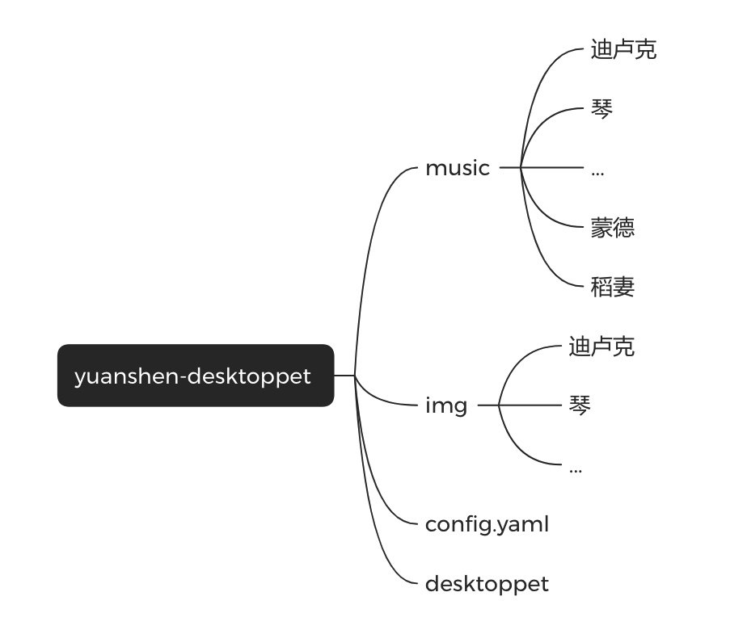
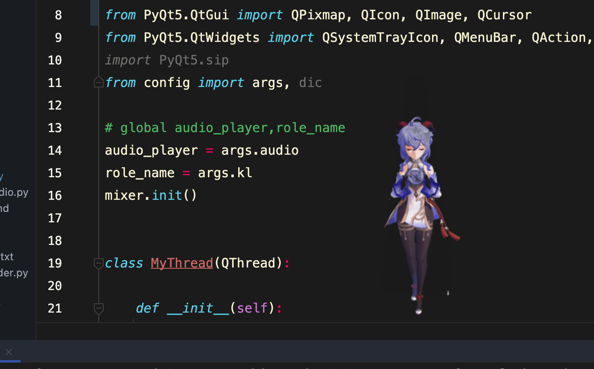
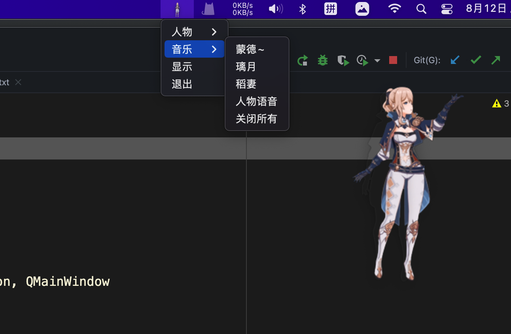
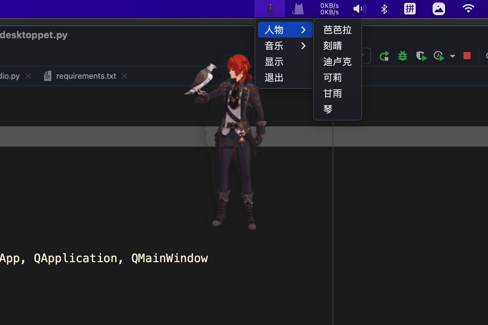
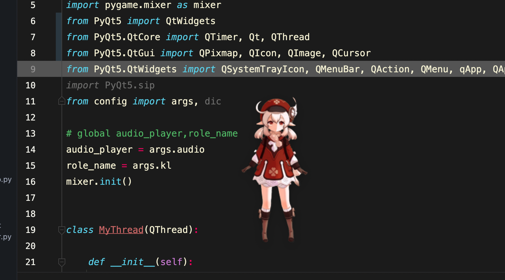
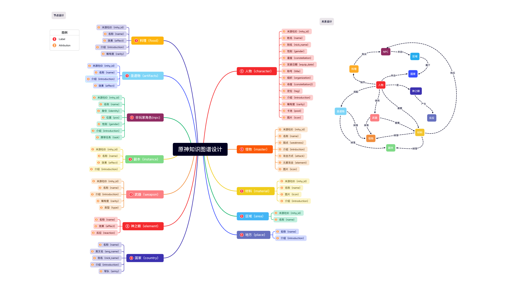
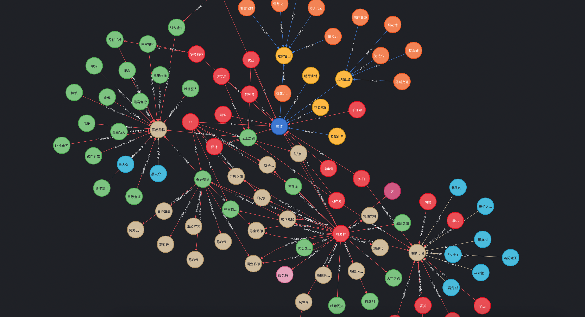

# 原神-基于python3的桌面宠物

#### 项目介绍

想打造一个桌面端原神智能语音助手，利用收集到的三元组数据搭建原神知识图谱，通过预训练模型进行语音识别和智能问答，并且需要进行音色转换！ 
注：绿幕素材来源于B站UP:皮皮虾米锅巴 
附上自己转换的链接：链接: https://pan.baidu.com/s/1AuUjMnYgNScTla7yQA19Og 提取码: yxm5 
如有侵权请告知，请勿涉及商业用途，否则后果自负！ 

#### 软件架构

什么辣鸡架构我不知道，我只知道原来你也玩原神！（狗头保命）

#### 安装教程
A：Terminal/cmd（终端操作）
1. git clone https://gitee.com/fg_slash/yuanshen-python3-desktoppet.git 克隆项目。
2. cd yuanshen-python3-desktoppet 进入目录 pip install -r requirements.txt 安装依赖。
3. 在config.yaml中配置自己对应的路径和设置
4. python desktoppet.py 运行py文件。或直接在PyCharm等编辑器中直接右键运行。

#### 使用说明

1. 基于pyqt5开发的原神桌面宠物，目前支持可莉、芭芭拉、刻晴、万叶等近30个人物。
2. 目前png和gif图片已经全部转换完成，由于涉及版权问题，暂时不做上传，项目下载安装好依赖就可以运行。
3. 着实不太建议非社交牛逼症患者在白天以及人多的地方使用，社交牛逼症患者或二刺猿重度患者请自便。
4. *****友情提示：语音默认开启。（上班请静音，小心社死！dddd！）*****
5. 文件目录如下图所示:

#### 功能说明

1. 支持人物的切换、拖动、隐藏、简单交互。
2. 快捷键说明：macOS==>缩放人物：Command + Command - 退出 Command Q  
Windows==>缩放人物：Ctrl + Ctrl - 退出 Ctrl Q
3. 支持背景音乐和人物语音播放。（音量调节待开发中）
4. 支持自行添加人物、语音、音乐，需要一定的代码能力。
5. 人物支持:可莉、芭芭拉、刻晴、万叶、迪卢克、阿贝多、八重神子、班尼特、达达利亚、迪奥娜、菲谢尔、甘雨、 胡桃、荒泷一斗、雷电将军、莫娜、七七、琴、神里绫华、神里绫人、温迪、宵宫、魈、心海、行秋、夜兰、荧、优菈、早柚、钟离。

#### 界面展示

#### 后期开发（V2.0）
1. 基于原神信息的知识图谱。(马上完成)
2. 基于米游社社区文本数据和Bert的领域微调模型（进行中）
3. 用户语音输入，意图识别。(未开始)
4. 部分人物的语音合成和自动问答。(未开始)

#### 参与贡献

1. 一个默默无闻的60级小萌新罢了。

### 知识图谱设计
#### 节点设计（12类） 
人物：character 
武器：weapon 
神之眼：element 
国家：country 
地区：area 
二级地区：place 
材料：material 
副本：instance 
非玩家角色：npc 
怪物：master 
料理：food 
圣遗物：artifacts 
#### 关系设计（14类） 
人物-神之眼是-神之眼 
人物-特殊料理是-料理 
人物-来自-国家 
人物-突破材料是-突破材料 
人物-圣遗物是-圣遗物 
人物-培养材料是-培养材料 
人物-武器是-武器 
料理-原料是-制作材料 
地区-属于-国家 
二级地区-属于-地区（暂无） 
副本-掉落-圣遗物 
副本-掉落-材料 
副本-位于-地区 
怪物-掉落-材料 
武器-突破材料是-材料 

### 知识图谱展示（部分）
知识图谱采用neo4j搭建，所有数据均来自米游社官方（网络爬虫获取），并且通过数据清洗，在最终完成后会公开所有数据。 

#### 特技

1. 提瓦特大陆再见！满命甘雨真好玩！
2. 3.2冲鸭！
3. 草神没有抽到，可恶，ಥ﹏ಥ！
